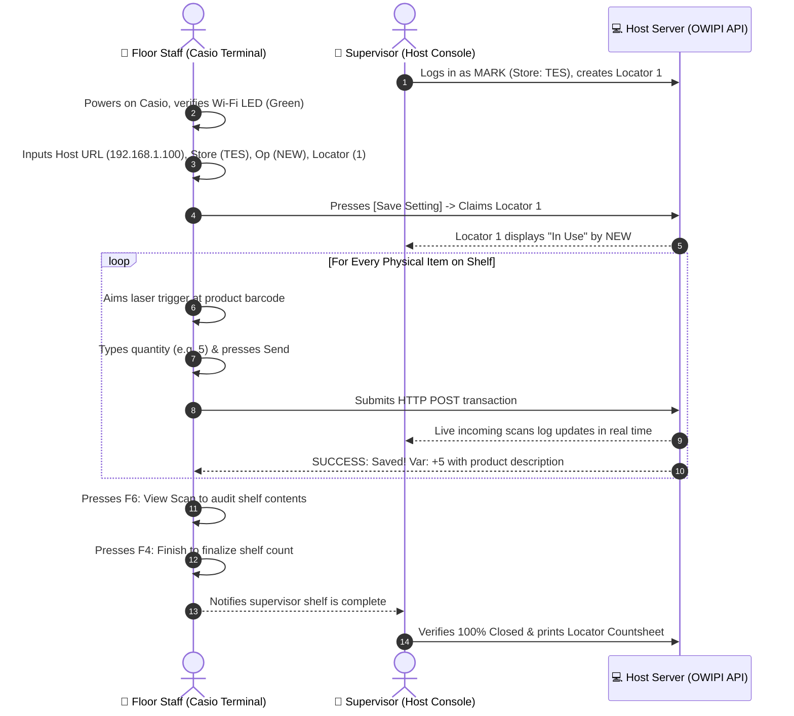

# OWIPI — Casio Industrial Handheld Scanner User Manual

> **Application**: `OWI PI Scanner App`  
> **Hardware Support**: Casio Mobile Computer / Windows CE Handheld Terminals (e.g. IT-G500, DT-X8, IT-800 series)  
> **Server Integration**: OWI Physical Inventory REST API (`scan.php` & `api.php`)  
> **Visual Simulator**: [docs/casio_scanner_visual_manual.html](file:///c:/xampp/htdocs/OWIPI/docs/casio_scanner_visual_manual.html)

---

## 1. System Architecture Overview

The **Casio Industrial Scanner App** is the rugged mobile client of the **OWI Physical Inventory (OWIPI)** ecosystem. It allows retail store teams and warehouse operators to perform high-speed laser scanning of barcodes with instantaneous masterfile catalog lookups, quantity batch submissions, and live physical count discrepancy tracking.

```
+----------------------------------------------------------------------------------------------------+
|                                    OWIPI SYSTEM ARCHITECTURE                                       |
+----------------------------------------------------------------------------------------------------+
|                                                                                                    |
|  [📱 Casio Mobile Terminal]              [📱 Smartphone Scanners]       [💻 Host Console (scan.php)]|
|   OWI PI Scanner App                      Mobile Web Browser               Supervisor Laptop       |
|   (Laser Trigger & Keypad)                (Camera Barcode)                 (Store: TES / RME)      |
|           │                                      │                                 │               |
|           └──────────────────┬───────────────────┘                                 │               |
|                              ▼ HTTP JSON REST API                                  │               |
|                   +─────────────────────────────────────────+                      │               |
|                   │    OWIPI Local Host Web Server & DB     │◄─────────────────────┘               |
|                   │         (XAMPP / MySQL / PHP)           │                                      |
|                   +────────────────────┬────────────────────+                                      |
|                                        │ ☁️ Periodic Sync                                          |
|                                        ▼                                                           |
|                   +─────────────────────────────────────────+                                      |
|                   │     Central HQ Cloud Inventory API      │                                      |
|                   +─────────────────────────────────────────+                                      |
+----------------------------------------------------------------------------------------------------+
```

---

## 2. Hardware Keypad & Function Keys Reference

The Casio keypad maps directly to physical function shortcuts for rapid, one-handed operational speed:

| Key / Control | Screen 1 (Config) | Screen 2 (Scan Mode) | Screen 3 (View Scans) |
| :--- | :--- | :--- | :--- |
| **`🔫 Laser Trigger`** | N/A | Fires 1D/2D laser engine into `Scan Barcode` | N/A |
| **`F1`** | **Exit System** (Closes App) | **Change Config** (Returns to Screen 1) | N/A |
| **`F4`** | N/A | **Finish Shelf** (Finalizes locator slot) | **Back to Scan** (Returns to Screen 2) |
| **`F6`** | N/A | **View Scan** (Opens Screen 3 table) | N/A |
| **`F7`** | N/A | **Clear** (Erases active input fields) | **Delete** (Removes highlighted scan row) |
| **`Alpha / Mode`** | Toggles `[ABC]` vs `[123]` | Toggles `[123]` vs `[ABC]` | Toggles `[123]` vs `[ABC]` |
| **`Enter / Send`** | Executes `[Save Setting]` | Submits Barcode & QTY to Server | Executes `[Edit]` |
| **`⬆️ / ⬇️ Arrows`** | Navigates input textboxes | Navigates input textboxes | Scrolls through scanned item rows |

---

## 3. Screen 1: Configuration & Host Pairing

Before scanning begins, the Casio terminal is paired with the local supervisor host laptop over Wi-Fi.

```
+----------------------------------------------------+
| OWI PI Scanner App                             [X] |
| OWI PHYSICAL INVENTORY                       [ABC] |
+----------------------------------------------------+
| Host URL / IP:                                     |
| [ http://192.168.1.100/OWIPI                     ] |
|                                                    |
| Store Code:               Operator Name:           |
| [ TES                   ] [ NEW                  ] |
|                                                    |
| Locator / Slot (Numbers Only):                     |
| [ 1                                              ] |
|                                                    |
|            [        Save Setting        ]          |
|                                                    |
|            [      F1: EXIT SYSTEM       ]          |
+----------------------------------------------------+
```

### Field Breakdown:
1. **`Host URL / IP`**: The local HTTP endpoint of the host server (e.g. `http://192.168.1.100/OWIPI`). Must match the IP shown on the supervisor's `CONNECT SCANNER` card.
2. **`Store Code`**: Official branch identifier (e.g. `TES` or `RME`).
3. **`Operator Name`**: Name or ID of the staff operating this terminal (e.g. `NEW`, `MARK`, `RAYMART`).
4. **`Locator / Slot (Numbers Only)`**: The physical shelf, gondola, or bin number (e.g. `1`).
5. **`[Save Setting]`**: Commits configuration and transitions to Screen 2 (Scan Barcode).
6. **`[F1: EXIT SYSTEM]`**: Gracefully exits the scanner application to Windows CE desktop.

---

## 4. Screen 2: Active Barcode & Quantity Scanning

This is the primary counting screen where staff scan product barcodes and input batch quantities.

```
+----------------------------------------------------+
| OWI PI Scanner App                             [X] |
| OWI PHYSICAL INVENTORY                       [123] |
+----------------------------------------------------+
| [ F1: Change Config ]        Locator: 1            |
|                              Scanned #: 2          |
| Scan Barcode:                                      |
| [ 43100052005                                    ] |
|                                                    |
| Quantity (QTY):                                    |
| [ 5                                              ] |
|                                                    |
| [       Send        ]        [     F7: Clear     ] |
| [   F6: View Scan   ]        [    F4: Finish     ] |
|                                                    |
| +------------------------------------------------+ |
| | SUCCESS: Saved! Var: +5                        | |
| | NB SPI 05200 1SUBJ 100SHT 10.5X8IN             | |
| | Mst Qty: 0 | Scan: 5 | Var: +5                 | |
| +------------------------------------------------+ |
+----------------------------------------------------+
```

### Operational Steps:
1. **Scan Barcode**: Aim the laser at the product UPC. Pull the trigger; the barcode number populates automatically.
2. **Quantity (QTY)**:
   - For a single piece: Leave blank or enter `1`.
   - For bulk packs / master cartons: Type the piece count (e.g. `5`, `12`, `24`).
3. **Send**: Press **`Send`** (or hit keypad **`Enter`**).
4. **Instant Catalog Feedback**:
   - The feedback card displays catalog description, masterfile expected stock (`Mst Qty`), scanned count (`Scan`), and physical variance (`Var: +5`).
5. **Shelf Finalization**: When the shelf is fully counted, press **`F4: Finish`** to lock the locator.

---

## 5. Screen 3: View Scanned Items & In-Field Corrections

Pressing **`F6: View Scan`** from Screen 2 opens the itemized audit table of all products counted in the current shelf.

```
+----------------------------------------------------+
| OWI PI Scanner App                             [X] |
| OWI PHYSICAL INVENTORY                       [123] |
+----------------------------------------------------+
| Barcode          | Qty | Description               |
| 43100052005      | 5   | NB SPI 05200 1SUBJ 100SHT |
|                  |     |                           |
|                  |     |                           |
|                  |     |                           |
|                                                    |
| [       Edit        ]        [    F7: Delete     ] |
|                                                    |
| [                 F4: Back to Scan               ] |
+----------------------------------------------------+
```

### Table Controls & Actions:
- **`⬆️ / ⬇️ Navigation`**: Use keypad arrows to select rows.
- **`[Edit]`**: Prompts to modify the counted quantity of the selected product if a physical recount is required.
- **`[F7: Delete]`**: Removes an accidental duplicate or misassigned item scan.
- **`[F4: Back to Scan]`**: Returns immediately to Screen 2 with cursor focused in `Scan Barcode`.

---

## 6. Physical Inventory Standard Operating Procedure (SOP)



---

## 7. Troubleshooting & FAQs

### Q1: The Casio shows "Network Timeout" or cannot connect to Host.
- **Solution**:
  1. Verify the Casio is connected to the same Wi-Fi router as the supervisor laptop.
  2. Ping the host IP (`192.168.1.100`) from the Casio network utility.
  3. Ensure Windows Firewall on the host laptop allows incoming connections on port `80` / `8080`.

### Q2: Laser trigger does not emit a beam.
- **Solution**:
  1. Check the top LED indicator. If battery is critically low, swap the rechargeable battery pack.
  2. Verify the barcode input field is currently active and focused.

### Q3: Product displays "UNMATCHED" or variance alert.
- **Solution**:
  1. Confirm you scanned the primary retail UPC barcode rather than an internal carton serial.
  2. If the item is physically present in the store but missing from the masterfile catalog, alert the supervisor to add it via **Items Masterfile** on the Host Console.

---

## 8. Documentation Quick Links

- 📱 **[Interactive Casio Simulator](file:///c:/xampp/htdocs/OWIPI/docs/casio_scanner_visual_manual.html)**
- 💻 **[Host Console Visual Manual](file:///c:/xampp/htdocs/OWIPI/docs/host_view_visual_manual.html)**
- 🖥️ **[Control Dashboard Visual Manual](file:///c:/xampp/htdocs/OWIPI/docs/control_dashboard_visual_manual.html)**
- 📋 **[Host Console Markdown Manual](file:///c:/xampp/htdocs/OWIPI/docs/HOST_VIEW_MANUAL.md)**
- 🏠 **[Project Root](file:///c:/xampp/htdocs/OWIPI/README.md)**
