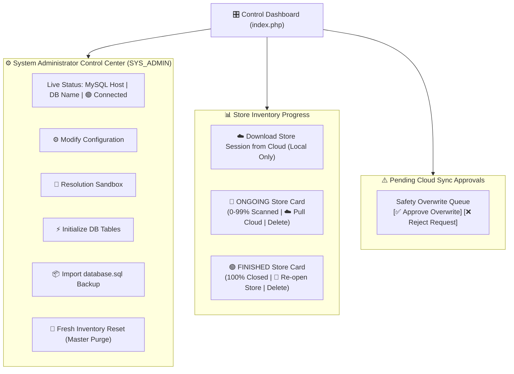
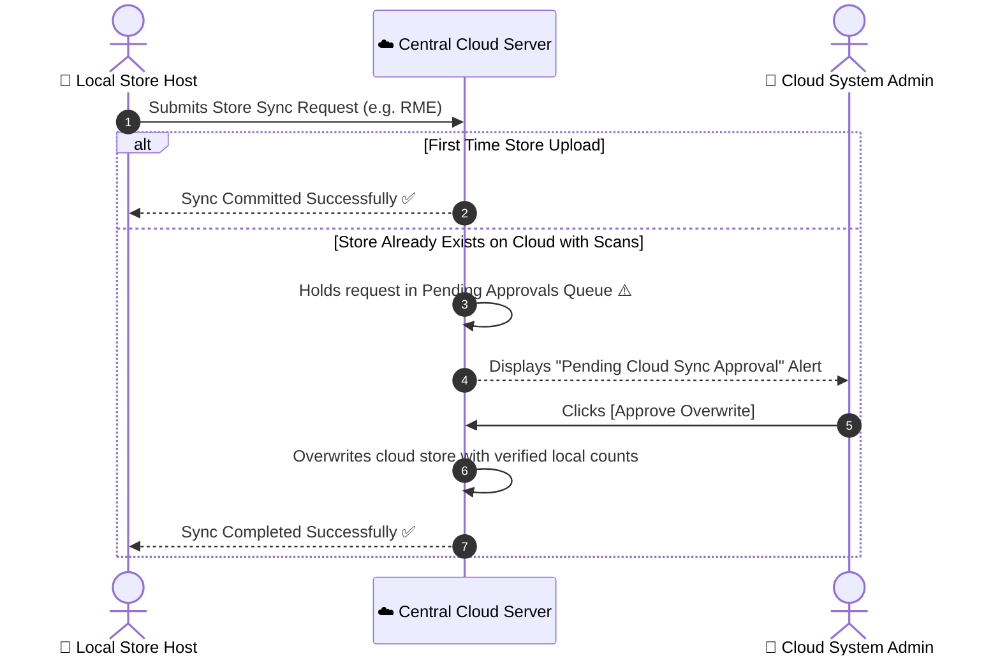

# 📘 OWI Physical Inventory — Control Dashboard Visual Manual

> 💡 **Interactive Visual Presentation**: You can also open the interactive presentation deck directly in your browser:  
> 👉 [**Open Interactive HTML Presentation Manual**](file:///c:/xampp/htdocs/OWIPI/docs/control_dashboard_visual_manual.html)

---

## 🖥️ Visual Layout & Architecture Map



---

## 📑 Visual Section-by-Section Reference

```
+-------------------------------------------------------------------------------------------------------------------+
| ⚙️ System Administrator Control Center  [SYS_ADMIN]                 MYSQL HOST       DATABASE       ● Connected   |
|    Manage database connections, table schemas, backups, and maintenance  localhost:3306   owi_inventory               |
|                                                                                                                   |
| [⚙️ Modify Config]  [🧪 Resolution Sandbox]  [⚡ Initialize DB Tables]  [📦 Import database.sql Backup]  [🧹 Fresh Reset] |
+-------------------------------------------------------------------------------------------------------------------+
```

### 1. System Administrator Control Center

| Control | Visual Style | Purpose & Operational Function |
| :--- | :--- | :--- |
| **Status Pill** | `Host: 3306` \| `DB` \| 🟢 `Connected` | Real-time database heartbeat monitor. Confirms active PDO connection. |
| **⚙️ Modify Configuration** | Dark Ghost Button | Opens the database & sync configuration form to adjust ports, passwords, or secret tokens. |
| **🧪 Resolution Sandbox** | Purple Glowing Pill | Launches the live multi-device resolution testing simulator (`sandbox.php`). |
| **⚡ Initialize DB Tables** | Emerald Green Button | Builds/validates mandatory system tables (`stores`, `items`, `users`, `audit_logs`, `cloud_backups`). |
| **📦 Import database.sql** | Blue Accent Button | Imports default catalog, store IDs, and master schema without using phpMyAdmin. |
| **🧹 Fresh Inventory Reset** | Crimson Danger Button | **Master Purge Tool**: Drops all dynamic store tables while preserving `items`, `stores_id`, and `users`. |

---

### 2. Store Inventory Progress & Session Cards

```
+-------------------------------------------------------------------------------------------------------------------+
| Store Inventory Progress                                                        [☁️ Download Store Session from Cloud] |
|                                                                                                                   |
| +--------------------------------+  +--------------------------------+  +--------------------------------+        |
| | RME                  [ONGOING] |  | SME                 [FINISHED] |  | TES                 [FINISHED] |        |
| | Created by: MARK               |  | Created by: BETH               |  | Created by: ALLAN              |        |
| | Store Completion            0% |  | Store Completion          100% |  | Store Completion          100% |        |
| | [                            ] |  | [============================] |  | [============================] |        |
| | 0 of 3 closed                  |  | 3 of 3 closed                  |  | 10 of 10 closed                |        |
| | [☁️ Pull Cloud Session] [Delete]|  | [🔄 Re-open Store]    [Delete] |  | [🔄 Re-open Store]    [Delete] |        |
| +--------------------------------+  +--------------------------------+  +--------------------------------+        |
+-------------------------------------------------------------------------------------------------------------------+
```

#### Lifecycle State Matrix:

| Status Badge | Progress | Active Controls | Operational Meaning |
| :---: | :---: | :---: | :--- |
| <span style="color:#60a5fa;font-weight:700;">🔵 ONGOING</span> | `0% - 99%` | `☁️ Pull Cloud Session`<br>`Delete` | Store count is active. Scanners are scanning barcodes into open locators. |
| <span style="color:#34d399;font-weight:700;">🟢 FINISHED</span> | `100%` | `🔄 Re-open Store`<br>`Delete` | All locators are closed. Ready for variance export and consolidation. |
| <span style="color:#f87171;font-weight:700;">🔴 CLOSED</span> | `100%` | `🔄 Re-open Store`<br>`Delete` | Count session is archived and read-only. |

---

### 3. Cloud Sync Safety Overwrite Protocol



---

### 4. Resolution Sandbox Simulator

```
+-------------------------------------------------------------------------------------------------------------------+
| 🧪 Resolution Sandbox  [Live Simulator]   Target: [📱 Scanner App (scan.php) ▼]                                   |
| [📟 CE 240x320] [📱 Mobile 375p] [🔄 Land. 812p] [📱 Tablet 768p] [💻 Laptop 768p] [🖥️ 1080p] [🖥️ 2K/4K] [⬅️ Exit]  |
+-------------------------------------------------------------------------------------------------------------------+
|  +-------------------------------------------------------------------------------------------------------------+  |
|  | ● ● ●  Laptop HD (1366x768)                                                               scan.php  🔄      |  |
|  | +---------------------------------------------------------------------------------------------------------+ |  |
|  | |                                                                                                         | |  |
|  | |                                    [ Live Interactive App Viewport ]                                    | |  |
|  | |                                                                                                         | |  |
|  | +---------------------------------------------------------------------------------------------------------+ |  |
|  +-------------------------------------------------------------------------------------------------------------+  |
+-------------------------------------------------------------------------------------------------------------------+
```

---

## 5. Quick Reference & Keyboard Navigation

- Open [`docs/control_dashboard_visual_manual.html`](file:///c:/xampp/htdocs/OWIPI/docs/control_dashboard_visual_manual.html) in your browser.
- Use **Left/Right Arrow Keys** (`◀` / `▶`) on your keyboard to navigate between interactive presentation slides.
- Click any **Red Hotspot Pin** (① through ⑥) on Slide 1 for animated feature walkthroughs.
