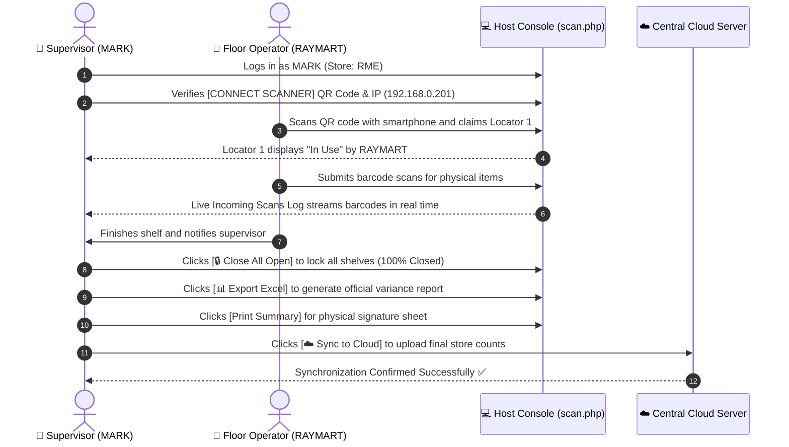

# OWIPI — Host Console (scan.php) Operational Manual
**Supervisor Role Reference: User `MARK` | Store: `RME`**

---

## 1. Executive Summary

The **Host Console (`scan.php`)** is the primary workstation for physical inventory supervisors (e.g. user **`MARK`** managing store **`RME`**). From this single screen, the supervisor oversees wireless mobile barcode scanners, monitors live scan ingestion, assigns locators to floor operators, closes completed shelves, exports consolidated Excel variance reports, calibrates printer margins, and pushes final verified store counts to the central cloud.

---

## 2. Host Console UI Layout (Pixel-Perfect Reference)

```
+---------------------------------------------------------------------------------------------------------------------------------------------+
| OWI PHYSICAL INVENTORY                                           [📁 Upload Masterfile] [☁️ Download Store Masterfile]                     |
| STORE CODE : RME                                                 [☁️ Sync to Cloud]     [🔒 Close Store]                                    |
| User: MARK                                                       [● Offline (Local)]    [Log Out]                                           |
+---------------------------------------------------------------------------------------------------------------------------------------------+
|                                                                                                                                             |
|  +-----------------------------------+  +--------------------------------------+  +------------------------------------------------------+  |
|  | LOCATOR PROGRESS  INF:0 SCANNERS:1|  | CONNECT SCANNER                    ❖ |  | 🖨️ PRINT SPACING SETTINGS                           |  |
|  |                                   |  |                                      |  | TOP MARGIN (MM)            LEFT MARGIN (MM)          |  |
|  |     ( 0% )  Closed (Done):   0    |  |  +---------+  Scan QR code w/ phone. |  | [ 0                      ] [ 10                     ] |  |
|  |     CLOSED  Active / Open:   3    |  |  | 🏁 QR   |  Host Network IP:       |  |                                                      |  |
|  |             Total Locators:  3    |  |  |  CODE   |  [ 192.168.0.201 ▼ ]    |  | +--------------------------------------------------+ |  |
|  |                                   |  |  +---------+                         |  | | [Save Spacing]                                   | |  |
|  | [🔍 Search Item (Barcode/SKU)...] |  |                                      |  | +--------------------------------------------------+ |  |
|  +-----------------------------------+  +--------------------------------------+  +------------------------------------------------------+  |
|                                                                                                                                             |
|  +-------------------------------------------------------------+  +-------------------------------------------------------------------------+  |
|  | LIVE INCOMING SCANS LOG                                     |  | COUNT SHEET & LOCATORS  [📊 Export Excel] [Print] [🔒 Close All] [+ Add] |  |
|  | [🔍 Search live incoming scans...                         ] |  | [🔍 Search locators...                                                ] |  |
|  | +---------------------------------------------------------+ |  | +---------------------------------------------------------------------+ |  |
|  | | Barcode | ALU/SKU | Description | Qty | User | Loc | Time | |  | | Locator              | Status | Scanned By | Action                   | |  |
|  | |---------+---------+-------------+-----+------+-----+------| |  | |----------------------+--------+------------+--------------------------| |  |
|  | |                                                         | |  | | 1 (0-items scanned)  | In Use | RAYMART    | [View] [Force Close]     | |  |
|  | |  No scans logged yet. Connect a mobile device to start! | |  | | 2 (0-items scanned)  | Open   | -          | [View] [Close] [Delete]  | |  |
|  | |                                                         | |  | | 3 (0-items scanned)  | Open   | -          | [View] [Close] [Delete]  | |  |
|  | +---------------------------------------------------------+ |  | +---------------------------------------------------------------------+ |  |
|  +-------------------------------------------------------------+  +-------------------------------------------------------------------------+  |
+---------------------------------------------------------------------------------------------------------------------------------------------+
```

---

## 3. Detailed Breakdown of Host Console Components

### 1. Store & Supervisor Context
- **Title**: `OWI PHYSICAL INVENTORY`
- **Store Code**: `STORE CODE : RME`
- **User Identity**: `User: MARK` (Confirms session credentials and supervisor privileges).

### 2. Header Action Controls
| Control | Button Type | Function |
| :--- | :--- | :--- |
| **📁 Upload Masterfile** | Dark Slate | Allows uploading a fresh CSV/Excel item catalog with barcodes, SKUs, and retail prices. |
| **☁️ Download Store Masterfile** | Emerald Green | Downloads branch product masterfile directly from the central cloud server. |
| **☁️ Sync to Cloud** | Ocean Blue | Pushes all verified local scan data, locators, and item totals to headquarters. |
| **🔒 Close Store** | Red Badge | Archives the store count session and marks the branch 100% Closed. |
| **● Offline (Local)** | Status Pill | Displays whether the workstation is connected locally or reaching the cloud gateway. |

---

### 3. Top Row KPI & Hardware Cards

#### A. LOCATOR PROGRESS Card
- **Scanners Online**: Real-time counter showing `SCANNERS: 1` and `INF: 0`.
- **0% CLOSED Gauge**: Circle meter showing overall store completion percentage.
- **Breakdown Table**:
  - `Closed (Done)`: Count of locked shelves ready for export.
  - `Active / Open`: Count of shelves currently available or in use.
  - `Total Locators`: Grand total of all created zones.
- **Search Item Input**: Quick lookup bar to search products by Barcode or ALU/SKU.

#### B. CONNECT SCANNER Card
- **Wi-Fi QR Code**: High-contrast QR code for instant mobile phone camera pairing.
- **Host Network IP**: Selectable network adapter IP (e.g. `192.168.0.201 (LOCAL)`). Mobile devices on the same Wi-Fi connect to this address.

#### C. PRINT SPACING SETTINGS Card
- **TOP MARGIN (MM)**: Vertical spacing adjustment (default `0`).
- **LEFT MARGIN (MM)**: Horizontal indentation calibration (default `10`).
- **Save Spacing Button**: Calibrates thermal printer margins so count receipts and labels print centered without edge clipping.

---

### 4. Bottom Row 50/50 Dual Tables

#### A. LIVE INCOMING SCANS LOG
- **Real-Time Feed**: Ingests scans live from mobile operators with Barcode, ALU/SKU, Description, Quantity, Scanned By, Locator, and Time.
- **Search Filter**: Filter stream by product name or operator username.

#### B. COUNT SHEET & LOCATORS Manager
- **Toolbar Actions**:
  - **📊 Export Excel**: Generates `.xlsx` workbook with price valuations and inventory variances.
  - **Print Summary**: Generates printable 80mm thermal receipt or A4 summary audit sheets.
  - **🔒 Close All Open**: One-click batch closure that locks all remaining open shelves simultaneously.
  - **+ Add Locator**: Automatically generates the next sequential shelf number (`1`, `2`, `3`, etc.).
- **Locator Row States**:
  - **`In Use` (Orange Pill)**: An operator (e.g. `RAYMART`) is actively scanning inside this shelf. Actions: `[View]` `[Force Close]`.
  - **`Open` (Green Pill)**: Shelf is available for any operator to claim. Actions: `[View]` `[Close]` `[Delete]`.
  - **`Closed`**: Shelf count is locked and finalized.

---

## 4. Operational Sequence Diagram



---

## 5. Quick Links

- **Interactive Presentation Simulator**: [docs/host_view_visual_manual.html](file:///c:/xampp/htdocs/OWIPI/docs/host_view_visual_manual.html)
- **Control Dashboard Manual**: [docs/CONTROL_DASHBOARD_MANUAL.md](file:///c:/xampp/htdocs/OWIPI/docs/CONTROL_DASHBOARD_MANUAL.md)
- **Live Host Console**: [scan.php](file:///c:/xampp/htdocs/OWIPI/scan.php)
