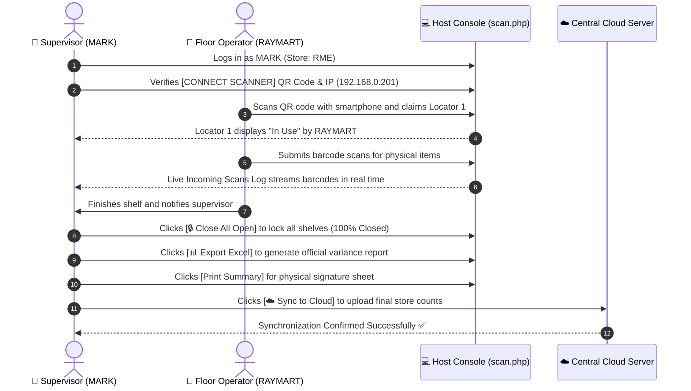

# OWIPI — Host Console (scan.php) Operational Manual
**Supervisor Role Reference: User `MARK` | Store: `RME`**

---

## 1. Executive Summary

The **Host Console (`scan.php`)** is the primary workstation for physical inventory supervisors (e.g. user **`MARK`** managing store **`RME`**). From this single screen, the supervisor oversees wireless mobile barcode scanners, monitors live scan ingestion, assigns locators to floor operators, closes completed shelves, exports consolidated Excel variance reports, calibrates printer margins, and pushes final verified store counts to the central cloud.

---

## 2. Host Console UI Layout (Pixel-Perfect Reference)

```
+---------------------------------------------------------------------------------------------------------------------------------------------+
| OWI PHYSICAL INVENTORY                                           [📁 Upload Masterfile] [☁️ Download Store Masterfile]                     |
| STORE CODE : RME                                                 [☁️ Sync to Cloud]     [🔒 Close Store]                                    |
| User: MARK                                                       [● Offline (Local)]    [Log Out]                                           |
+---------------------------------------------------------------------------------------------------------------------------------------------+
|                                                                                                                                             |
|  +-----------------------------------+  +--------------------------------------+  +------------------------------------------------------+  |
|  | LOCATOR PROGRESS  INF:0 SCANNERS:1|  | CONNECT SCANNER                    ❖ |  | 🖨️ PRINT SPACING SETTINGS                           |  |
|  |                                   |  |                                      |  | TOP MARGIN (MM)            LEFT MARGIN (MM)          |  |
|  |     ( 0% )  Closed (Done):   0    |  |  +---------+  Scan QR code w/ phone. |  | [ 0                      ] [ 10                     ] |  |
|  |     CLOSED  Active / Open:   3    |  |  | 🏁 QR   |  Host Network IP:       |  |                                                      |  |
|  |             Total Locators:  3    |  |  |  CODE   |  [ 192.168.0.201 ▼ ]    |  | +--------------------------------------------------+ |  |
|  |                                   |  |  +---------+                         |  | | [Save Spacing]                                   | |  |
|  | [🔍 Search Item (Barcode/SKU)...] |  |                                      |  | +--------------------------------------------------+ |  |
|  +-----------------------------------+  +--------------------------------------+  +------------------------------------------------------+  |
|                                                                                                                                             |
|  +-------------------------------------------------------------+  +-------------------------------------------------------------------------+  |
|  | LIVE INCOMING SCANS LOG                                     |  | COUNT SHEET & LOCATORS  [📊 Export Excel] [Print] [🔒 Close All] [+ Add] |  |
|  | [🔍 Search live incoming scans...                         ] |  | [🔍 Search locators...                                                ] |  |
|  | +---------------------------------------------------------+ |  | +---------------------------------------------------------------------+ |  |
|  | | Barcode | ALU/SKU | Description | Qty | User | Loc | Time | |  | | Locator              | Status | Scanned By | Action                   | |  |
|  | |---------+---------+-------------+-----+------+-----+------| |  | |----------------------+--------+------------+--------------------------| |  |
|  | |                                                         | |  | | 1 (0-items scanned)  | In Use | RAYMART    | [View] [Force Close]     | |  |
|  | |  No scans logged yet. Connect a mobile device to start! | |  | | 2 (0-items scanned)  | Open   | -          | [View] [Close] [Delete]  | |  |
|  | |                                                         | |  | | 3 (0-items scanned)  | Open   | -          | [View] [Close] [Delete]  | |  |
|  | +---------------------------------------------------------+ |  | +---------------------------------------------------------------------+ |  |
|  +-------------------------------------------------------------+  +-------------------------------------------------------------------------+  |
+---------------------------------------------------------------------------------------------------------------------------------------------+
```

---

## 3. Detailed Breakdown of Host Console Components

### 1. Store & Supervisor Context
- **Title**: `OWI PHYSICAL INVENTORY`
- **Store Code**: `STORE CODE : RME`
- **User Identity**: `User: MARK` (Confirms session credentials and supervisor privileges).

### 2. Header Action Controls
| Control | Button Type | Function |
| :--- | :--- | :--- |
| **📁 Upload Masterfile** | Dark Slate | Allows uploading a fresh CSV/Excel item catalog with barcodes, SKUs, and retail prices. |
| **☁️ Download Store Masterfile** | Emerald Green | Downloads branch product masterfile directly from the central cloud server. |
| **☁️ Sync to Cloud** | Ocean Blue | Pushes all verified local scan data, locators, and item totals to headquarters. |
| **🔒 Close Store** | Red Badge | Archives the store count session and marks the branch 100% Closed. |
| **● Offline (Local)** | Status Pill | Displays whether the workstation is connected locally or reaching the cloud gateway. |

---

### 3. Top Row KPI & Hardware Cards

#### A. LOCATOR PROGRESS Card
The central mission control indicator tracking real-time counting progress across all retail shelves:

| Indicator / Metric | Operational Meaning | Value / Formula | Stakeholder Action Required |
| :--- | :--- | :--- | :--- |
| **🔵 0% CLOSED Gauge** | Store Finalization Progress | `(Closed Locators ÷ Total Locators) × 100%` | Reaches 100% when all shelf countsheets are closed. |
| **⚠️ INF (Items Not Found)** | Unmatched Barcode Alarm | Real-time count of barcodes missing from Masterfile | If `INF > 0`, supervisor must inspect physical item and register SKU in Items Masterfile. |
| **📱 SCANNERS (Active Handhelds)** | Wireless Client Counter | Real-time count of connected mobile phone/laser clients | If `SCANNERS: 0`, check local Wi-Fi router connectivity. |
| **🟢 Closed (Done)** | Finalized Shelves Count | Integer (e.g. `0`) | Count of shelves audited and locked against edits. |
| **🟡 Active / Open** | Ongoing Shelves Count | Integer (e.g. `3`) | Shelves currently in progress or waiting to be claimed. |
| **⚪ Total Locators** | Total Defined Zones | Integer (e.g. `3`) | Grand total of counting zones created in branch. |
| **🔍 Search Item Input** | Universal Store Item Finder | Real-time query (Barcode, ALU/SKU, Description) | Type any barcode or SKU to find which locator holds the item and the recorded quantity. |

#### B. CONNECT SCANNER Card
- **Wi-Fi QR Code**: High-contrast QR code for instant mobile phone camera pairing.
- **Host Network IP**: Selectable network adapter IP (e.g. `192.168.0.201 (LOCAL)`). Mobile devices on the same Wi-Fi connect to this address.

#### C. PRINT SPACING SETTINGS Card
- **TOP MARGIN (MM)**: Vertical spacing adjustment (default `0`).
- **LEFT MARGIN (MM)**: Horizontal indentation calibration (default `10`).
- **Save Spacing Button**: Calibrates thermal printer margins so count receipts and labels print centered without edge clipping.

---

### 4. Bottom Row 50/50 Dual Tables

#### A. LIVE INCOMING SCANS LOG
The real-time operational stream ingesting barcodes wirelessly from handheld mobile units:

```
+---------------------------------------------------------------------------------------------------------------+
| Barcode      | ALU/SKU   | Description                  | Qty | Scanned By | Locator | Time     | Status      |
+--------------+-----------+------------------------------+-----+------------+---------+----------+-------------+
| 480004972001 | SKU-1001  | BALLPEN 0.5MM BLACK          | 12  | RAYMART    | 1       | 14:14:22 | Verified    |
| 480004972002 | SKU-1002  | CORRECTION TAPE 5M           | 5   | MARK       | 1       | 14:13:50 | Verified    |
| 480004972003 | SKU-1003  | SPIRAL NOTEBOOK 80LGS        | 24  | RAYMART    | 1       | 14:11:15 | Verified    |
| 480999888123 | UNMATCHED | [INF] Item Not in Masterfile | 1   | RAYMART    | 1       | 14:08:42 | ⚠️ Alert INF |
+---------------------------------------------------------------------------------------------------------------+
```

| Column Field | Explanation & Value | Operational Purpose |
| :--- | :--- | :--- |
| **Barcode** | e.g. `480004972001` | Physical UPC code scanned by laser or camera. |
| **ALU / SKU** | e.g. `SKU-1001` or `UNMATCHED` | Matched product identifier from active masterfile. |
| **Description**| e.g. `BALLPEN 0.5MM BLACK` | Catalog product name. |
| **Qty** | e.g. `12` | Number of physical units counted in this scan transaction. |
| **Scanned By**| e.g. `RAYMART`, `MARK` | Handheld user operator attribution. |
| **Locator** | e.g. `1` | Shelf number where the product was physically placed. |
| **Time** | e.g. `14:14:22` | Timestamp of ingestion. |
| **⚠️ UNMATCHED**| Amber/Red Highlight | Signals that an unknown item was scanned (`INF`). Supervisor must inspect item. |

#### B. COUNT SHEET & LOCATORS Manager Toolbar

| Action Button | Function & Output | Operational Definition & Modes |
| :--- | :--- | :--- |
| **📊 Export Excel** | Official Variance Workbook (`.xlsx`) | **Exports all store masterfile items that have system on-hand QTY** matched with actual **Scanned QTY** to calculate the physical variance (`Variance = Scanned Qty - System Qty`), matched unit cost, and total retail discrepancy valuation. |
| **🖨️ Print Summary** | Dual Print Dialog Modal | Opens the print preview dialog offering **2 distinct output modes**:<br>• **1. Print Summary**: Standard consolidated shelf counts formatted for branch manager and supervisor sign-off.<br>• **2. Print with Variance**: Detailed discrepancy audit report comparing System Inventory vs Actual Scanned counts side-by-side with variance highlights. |
| **🔒 Close All Open** | One-Click Batch Closure | Instantly transitions all open locators to `CLOSED`, locking all shelf counts and pushing store completion to 100%. |
| **➕ Add Locator** | Automatic Sequence Increment | Detects the highest locator number and creates the next sequential shelf (e.g. `Locator 4`). |

- **Locator Row States**:
  - **`In Use` (Orange Pill)**: An operator (e.g. `RAYMART`) is actively scanning inside this shelf. Actions: `[View]` `[Force Close]`.
  - **`Open` (Green Pill)**: Shelf is available for any operator to claim. Actions: `[View]` `[Close]` `[Delete]`.
  - **`Closed`**: Shelf count is locked and finalized.

---

## 4. Operational Sequence Diagram



---

## 5. Quick Links

- **Interactive Presentation Simulator**: [docs/host_view_visual_manual.html](file:///c:/xampp/htdocs/OWIPI/docs/host_view_visual_manual.html)
- **Control Dashboard Manual**: [docs/CONTROL_DASHBOARD_MANUAL.md](file:///c:/xampp/htdocs/OWIPI/docs/CONTROL_DASHBOARD_MANUAL.md)
- **Live Host Console**: [scan.php](file:///c:/xampp/htdocs/OWIPI/scan.php)
