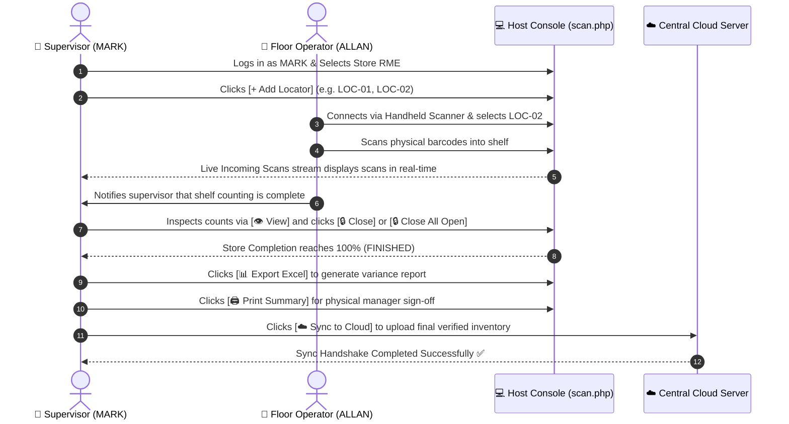

# OWIPI — Host Console (scan.php) Operational Manual
**Supervisor Role Reference: User `MARK` | Store: `RME (Robinsons Metro East)`**

---

## 1. Executive Summary

The **Host Console (`scan.php`)** is the primary on-site operational workstation for physical inventory supervisors (e.g. user **`MARK`**). From this console, the supervisor oversees all wireless mobile barcode scanners, monitors real-time scan ingestion, creates and closes shelf locators, audits item quantities, exports consolidated Excel variance reports, prints thermal audit summaries, and synchronizes final store counts to the central cloud.

---

## 2. Host Console UI Layout Diagram

```
+---------------------------------------------------------------------------------------------------------------------------------------------+
| 🏪 STORE: RME  [● Session Active]   ROBINSONS METRO EAST • Supervised by MARK            [☁️ Sync to Cloud] [📋 Variance Report] [🚪 Exit]   |
+---------------------------------------------------------------------------------------------------------------------------------------------+
|                                                                                                                                             |
|  +--------------------------+  +--------------------------+  +--------------------------+  +---------------------------------------------+  |
|  | TOTAL SCANNED QTY        |  | UNIQUE PRODUCTS          |  | TOTAL LOCATORS           |  | STORE COMPLETION                            |  |
|  | 1,420                    |  | 348                      |  | 8 / 12 (8 Closed, 4 Open)|  | [████████████████░░░░░░░░] 67%              |  |
|  +--------------------------+  +--------------------------+  +--------------------------+  +---------------------------------------------+  |
|                                                                                                                                             |
|  +-------------------------------------------------------------+  +-------------------------------------------------------------------------+  |
|  | 📡 Live Incoming Scans Log                   [● Live Stream] |  | 📑 Count Sheet & Locators  [Export Excel] [Print] [🔒 Close All] [+ Add] |  |
|  | [🔍 Search live incoming scans...                         ] |  | [🔍 Search locators...                                                ] |  |
|  | +---------------------------------------------------------+ |  | +---------------------------------------------------------------------+ |  |
|  | | Barcode      | SKU     | Description     | Qty | User   | |  | | Locator | Status | Scanned By | Actions                                | |  |
|  | |--------------+---------+-----------------+-----+--------| |  | |---------+--------+------------+----------------------------------------| |  |
|  | | 480004972001 | SKU-101 | BALLPEN 0.5MM   | 12  | MARK   | |  | | LOC-01  | OPEN   | MARK       | [👁️ View] [🔒 Close] [Delete]          | |  |
|  | | 480004972002 | SKU-102 | CORRECTION TAPE | 5   | ALLAN  | |  | | LOC-02  | CLOSED | ALLAN      | [👁️ View] [🔄 Re-open] [Delete]        | |  |
|  | | 480004972003 | SKU-103 | NOTEBOOK 80LGS  | 20  | MARK   | |  | | LOC-03  | CLOSED | MARK       | [👁️ View] [🔄 Re-open] [Delete]        | |  |
|  | +---------------------------------------------------------+ |  | +---------------------------------------------------------------------+ |  |
|  +-------------------------------------------------------------+  +-------------------------------------------------------------------------+  |
+---------------------------------------------------------------------------------------------------------------------------------------------+
```

---

## 3. Detailed Component Breakdown

### 1. Supervisor Identity & Store Context
- **Active Store Context**: Displays the current physical branch code (e.g. `STORE: RME`) and description (`ROBINSONS METRO EAST`).
- **Supervisor Attribution**: Confirms the session is authenticated as **`MARK`**. All locator closures, scan corrections, and summary audit sheets are stamped under user `MARK`.

### 2. ☁️ Sync to Cloud Protocol
- Uploads verified local store counts, active locators, item quantities, and operator timestamps directly to the central cloud server.
- **Safety Gate**: If the store already exists on cloud with scan history, the cloud automatically queues the request under **Pending Cloud Sync Approvals** for system administrator authorization before committing the overwrite.

### 3. KPI Metrics Dashboard
| Metric Card | Definition | Operational Formula |
| :--- | :--- | :--- |
| **Total Scanned Qty** | Total physical units counted across all shelves. | `SUM(scans.qty)` |
| **Unique Products** | Number of distinct product SKUs recognized in masterfile. | `COUNT(DISTINCT scans.upc)` |
| **Total Locators** | Breakdown of closed shelves vs active open shelves. | `Closed Locators / Total Locators` |
| **Store Completion** | Overall progress percentage towards complete count closure. | `(Closed Locators / Total Locators) × 100%` |

---

### 4. 📡 Live Incoming Scans Stream
- Real-time log updating as mobile operators scan barcodes with their handheld lasers or phone cameras.
- Displays Barcode (UPC), SKU, Description, Scanned Quantity, Operator Username (`MARK`, `ALLAN`, etc.), Assigned Locator (`LOC-01`), and Timestamp.
- **Instant Search**: Search keyword or SKU to check if a specific item was scanned and where it was placed.

---

### 5. 📑 Count Sheet & Locators Manager Toolbar

| Control Button | Action Triggered | Operational Purpose |
| :--- | :--- | :--- |
| **📊 Export Excel** | `exportStoreVarianceExcel()` | Downloads comprehensive Excel `.xlsx` workbook with item quantities, system on-hand, and variance valuation. |
| **🖨️ Print Summary** | `openPrintSummaryModal()` | Generates physical 80mm thermal receipt or A4 summary count sheets for manager sign-off. |
| **🔒 Close All Open** | `handleCloseAllLocators()` | Batch closes all remaining open locators at once with confirmation prompt, pushing store completion to 100%. |
| **➕ Add Locator** | `autoAddNextLocator()` | Automatically sequences and generates the next locator number (e.g. `LOC-01` -> `LOC-02`). |

---

### 6. 👁️ Locator Item Audit & Manual Scans Modal
Clicking **`👁️ View`** on any locator row opens the **Items in Locator** inspection modal:
1. **Itemized Audit**: Displays every scan recorded inside that specific shelf with timestamps and quantities.
2. **Quantity Corrections**: Allows supervisors to adjust quantities or remove duplicate scans.
3. **+ Add Manual Scan**: If a physical item has a torn or missing barcode label, the supervisor can type the SKU or UPC manually and enter the verified shelf quantity.

---

## 4. End-to-End Store Counting Workflow



---

## 5. Quick Reference & Links

- **Interactive Presentation Simulator**: [docs/host_view_visual_manual.html](file:///c:/xampp/htdocs/OWIPI/docs/host_view_visual_manual.html)
- **Control Dashboard Manual**: [docs/CONTROL_DASHBOARD_MANUAL.md](file:///c:/xampp/htdocs/OWIPI/docs/CONTROL_DASHBOARD_MANUAL.md)
- **Live Host Console**: [scan.php](file:///c:/xampp/htdocs/OWIPI/scan.php)
