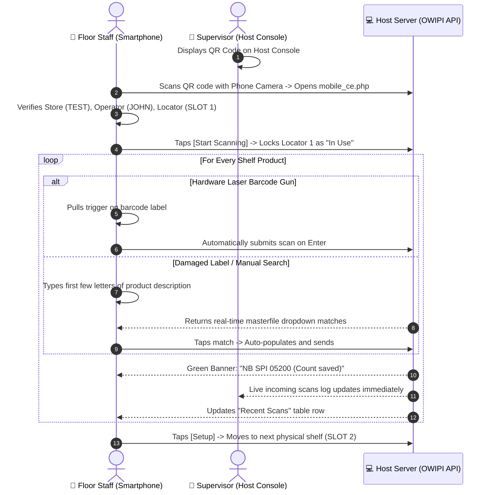

# OWIPI Mobile Phone Web Scanner Operational Guide & Technical Manual

This guide documents the **Mobile Phone Web Scanner** interface (`mobile_ce.php`), enabling retail floor staff and auditors to perform high-speed physical inventory counts directly from smartphones (iOS / Android) or handheld mobile web browsers.

---

## 📋 System Overview

The Mobile Phone Web Scanner is a lightweight, zero-installation web application designed for mobile devices. It connects to the supervisor's host server over local Wi-Fi and submits barcode transactions via REST API without requiring app store installations.

| Feature | Specification |
| :--- | :--- |
| **Target URL** | `http://<HOST_IP>/OWIPI/mobile_ce.php` |
| **Client Support** | iOS Safari, Android Chrome, Windows CE / Pocket PC Pocket Internet Explorer |
| **Input Methods** | Bluetooth 1D/2D Barcode Gun, USB OTG Laser Scanner, Touchscreen On-Screen Keyboard |
| **Real-Time Autocomplete** | Instant masterfile search with 300ms debounce (`api.php?action=search_masterfile`) |
| **Continuous Focus** | 1,000ms background interval ensuring laser scans are never dropped |
| **Audit Stream** | Live locator scan history (`api.php?action=get_scans_html`) |

---

## 📱 Interactive Screens Breakdown

### 1. Screen 1: Mobile Setup (`mode=setup`)

```
+------------------------------------------+
|            OWI Scanner Setup             |
+------------------------------------------+
|  Store Code:                             |
|  [ TEST                                ] |
|                                          |
|  Operator Name:                          |
|  [ JOHN                                ] |
|                                          |
|  Locator / Slot:                         |
|  [ SLOT 1                              ] |
|                                          |
|  [           Start Scanning            ] |
+------------------------------------------+
| Optimized for Smartphone & Pocket PC     |
+------------------------------------------+
```

#### Controls & Parameters:
1. **`Store Code`**: Binds the phone to the store branch session (e.g. `TEST` or `RME`).
2. **`Operator Name`**: Auditor's username (e.g. `JOHN`) for live supervisor attribution.
3. **`Locator / Slot`**: Numeric or alphanumeric shelf tag (e.g. `SLOT 1`, `GONDOLA 2`).
4. **`[Start Scanning]`**: Commits configuration and transitions to live scanning.

---

### 2. Screen 2: Barcode Scan & Instant Catalog Search (`mode=scan`)

```
+------------------------------------------+
|             OWI Scanner App              |
+------------------------------------------+
| Store: TEST | Loc: SLOT 1                |
| Op: JOHN                                 |
+------------------------------------------+
| [ NB SPI 05200 (Count saved)           ] | (Green Success Banner)
+------------------------------------------+
| Barcode / Description Target:            |
| [ 43100052005                          ] |
|                                          |
| +--------------------------------------+ |
| | NB SPI 05200 1SUBJ 100SHT            | | (Live Autocomplete Dropdown)
| | UPC: 43100052005 | SKU: SPI-052      | |
| +--------------------------------------+ |
|                                          |
| [    Send    ]          [   Setup   ]    |
+------------------------------------------+
```

#### Controls & Actions:
- **`Barcode / Description Input`**: Accepts laser gun barcode scans or typed text.
- **`Live Search Dropdown`**: Typing 2+ characters queries `api.php?action=search_masterfile` and displays instant matches. Tapping a match auto-fills and submits the item.
- **`[Send]`**: Asynchronously submits count to `api.php?action=submit_scan`.
- **`[Setup]` (Red Danger Button)**: Safely returns to Screen 1 while preserving current store and operator parameters.

---

### 3. Screen 3: Recent Scans Log & Shelf Audit

```
+------------------------------------------+
|             OWI Scanner App              |
+------------------------------------------+
| Store: TEST | Loc: SLOT 1                |
+------------------------------------------+
| [ READY TO SCAN                        ] |
+------------------------------------------+
| Recent Scans:                            |
| +-------------+--------------------+---+ |
| | Barcode     | Description        |Qty| |
| +-------------+--------------------+---+ |
| | 43100052005 | NB SPI 05200 1SUBJ | 5 | |
| | 48000160124 | GEL PEN 0.5MM      |12 | |
| +-------------+--------------------+---+ |
+------------------------------------------+
```

---

## ⚡ Smartphone Scanning Workflow (Sequence Diagram)



---

## 🛠️ Technical Implementation Notes

1. **Auto-Focus Keep-Alive**:
   ```javascript
   function keepFocus() {
       var barcodeEl = document.getElementById("barcode");
       if (barcodeEl) barcodeEl.focus();
   }
   setInterval(keepFocus, 1000);
   ```

2. **Debounced Masterfile Search**:
   ```javascript
   clearTimeout(barcodeSearchTimeout);
   barcodeSearchTimeout = setTimeout(function() {
       xhr.open("GET", "api.php?action=search_masterfile&q=" + encodeURIComponent(q), true);
       xhr.send();
   }, 300);
   ```

3. **URL-Encoded Payload**:
   ```javascript
   var postData = "barcode=" + encodeURIComponent(barcode) +
                  "&quantity=1" +
                  "&location=" + encodeURIComponent(config_loc) +
                  "&scanned_by=" + encodeURIComponent(config_op) +
                  "&store_code=" + encodeURIComponent(config_store);
   xhr.open("POST", "api.php?action=submit_scan", true);
   xhr.send(postData);
   ```
