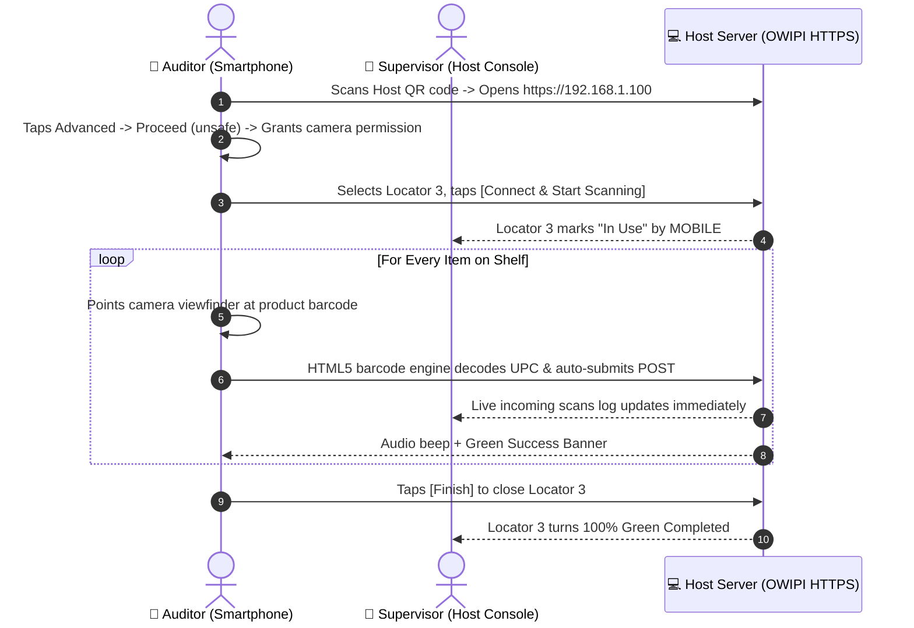

# OWIPI Smartphone Camera Scanner Operational Guide & Technical Manual

This guide documents the **Smartphone Camera Scanner** application, allowing auditors and retail staff to count physical inventory directly using smartphone cameras (iOS Safari & Android Chrome) over local Wi-Fi.

---

## 📸 Overview & Hardware Requirements

| Parameter | Specification |
| :--- | :--- |
| **Target URL** | `https://<HOST_IP>/OWIPI/` or `http://<HOST_IP>/OWIPI/` |
| **Supported Devices** | Android (Chrome), iOS (Safari), Tablets |
| **Hardware Features** | Live HTML5 Camera Viewfinder, Laser Reticle Target, Flashlight Torch, 1.0x–3.0x Zoom |
| **Security Context** | HTTPS required for `navigator.mediaDevices.getUserMedia` camera permissions |

---

## 📱 Interactive Screen Workflows

### 1. Screen 1: HTTPS & Camera Permission Bypass

Modern mobile browsers block camera access on unencrypted `http://` addresses. The application provides instant resolution workflows:

```
+----------------------------------------------------+
| OWI PHYSICAL INVENTORY                             |
| STORE CODE : TES              ● Offline (Local)   |
| User: BETH                                         |
+----------------------------------------------------+
| ⚠️ Camera Access Blocked (HTTP Origin)              |
| Mobile browsers block camera access on insecure    |
| HTTP addresses. To enable standard camera prompts: |
|                                                    |
| [ ⚡ Switch to Secure HTTPS                      ] |
|                                                    |
| Alternatively, use Chrome flag workaround:         |
| 1. chrome://flags/#unsafely-treat-insecure-origin  |
| 2. Set Enabled & add http://192.168.1.100          |
+----------------------------------------------------+
```

#### Chrome SSL Bypass Steps:
1. Tap **`[⚡ Switch to Secure HTTPS]`** (loads `https://192.168.1.100`).
2. On Chrome's *Your connection is not private* warning, tap **`[Advanced]`**.
3. Tap **`Proceed to 192.168.1.100 (unsafe)`**.
4. When prompted *Allow OWIPI to use your camera?*, tap **`Allow`**.

---

### 2. Screen 2: Mobile Scanner Setup Modal

```
+----------------------------------------------------+
|                   SCANNER SETUP                    |
+----------------------------------------------------+
| SCANNED BY                                         |
| [ MOBILE                                         ] |
|                                                    |
| SELECT/TYPE LOCATOR                                |
| [ Type/Select Locator (e.g. 1)...               ▼] |
|                                                    |
| [          Connect & Start Scanning              ] |
+----------------------------------------------------+
```

#### Setup Parameters:
- **`SCANNED BY`**: Defaults to `MOBILE` to differentiate camera entries from physical Casio laser terminals.
- **`SELECT/TYPE LOCATOR`**: Select open shelf from dropdown or type numeric shelf ID (e.g. `3`).
- **`[Connect & Start Scanning]`**: Engages camera and initializes live locator session.

---

### 3. Screen 3: Live Camera Barcode Scanner View

```
+----------------------------------------------------+
| OWI PHYSICAL INVENTORY                             |
| STORE CODE : TES              ● Offline (Local)   |
| User: BETH                                         |
+----------------------------------------------------+
| ACTIVE SESSION: Locator 3 • MOBILE                 |
| [ Change ]                         [ Finish (Green)|
+----------------------------------------------------+
| CAMERA SCANNER                             ● Live  |
| +------------------------------------------------+ |
| |                                                | |
| |             |--      --|                       | |
| |              (Laser Beam)                      | |
| |                                                | |
| +------------------------------------------------+ |
| 🔍 ZOOM: [======o=======] 1.0x      🔦 [OFF]     |
| [ Start Scanner (Blue) ]            [ Stop ]       |
+----------------------------------------------------+
| MANUAL BARCODE / DESCRIPTION INPUT               ▼ |
+----------------------------------------------------+
```

#### Camera Controls:
- **Viewfinder Reticle (`|-- --|`)**: Align barcode horizontally within brackets.
- **`🔍 ZOOM` Slider**: Adjust from `1.0x` to `3.0x` for high or distant shelves.
- **`🔦 FLASHLIGHT` Button**: Toggles phone LED torch for dark warehouse corners.
- **`[Finish]` (Green Button)**: Locks shelf locator and marks it completed on Host Console.
- **`MANUAL INPUT`**: Expandable fallback for typed UPC or masterfile catalog search.

---

## ⚡ Smartphone Camera Scan SOP


