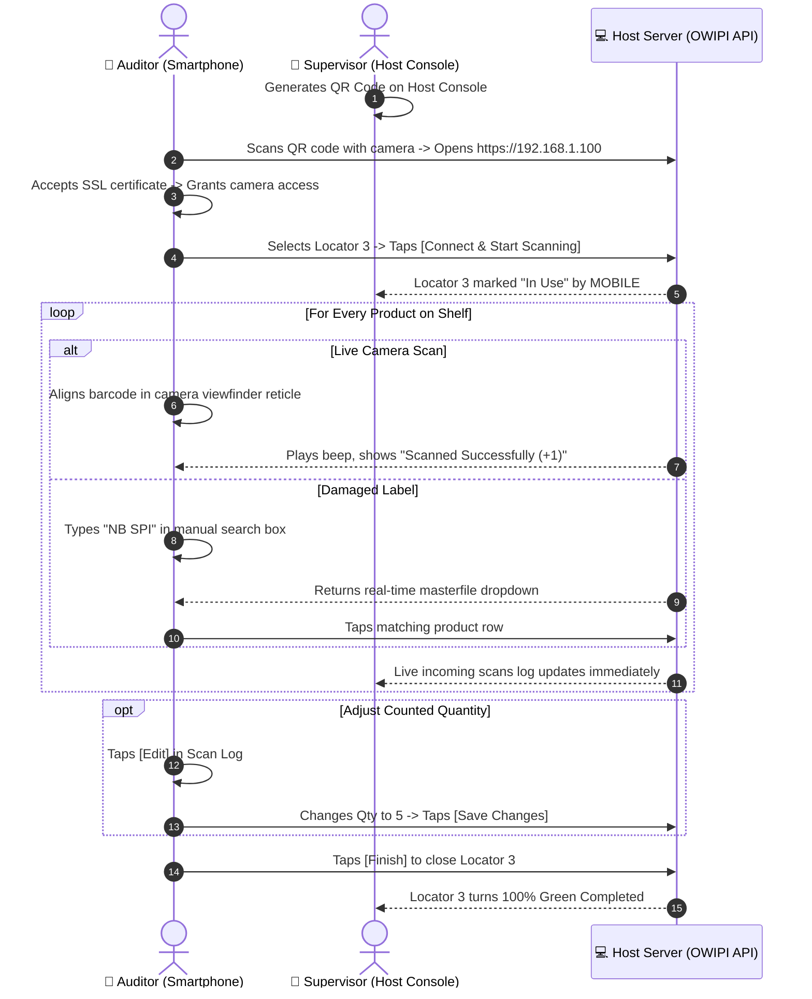

# OWIPI Smartphone Camera Scanner Operational Guide & Technical Manual

This guide documents the complete **Smartphone Camera Scanner** workflow for retail floor auditors and staff, built directly around field operations on iOS and Android devices.

---

## 📸 System Overview & Hardware Architecture

| Parameter | Specification |
| :--- | :--- |
| **Client Interface** | HTML5 WebAssembly Camera Scanner (Chrome on Android, Safari on iOS) |
| **Target URL** | `https://<HOST_IP>/OWIPI/` or `http://<HOST_IP>/OWIPI/` |
| **Engine Capabilities** | 30 FPS Barcode Scanning, Laser Reticle Target, Hardware Flashlight Torch, 1.0x–3.0x Zoom |
| **Security Context** | HTTPS required for standard `navigator.mediaDevices.getUserMedia` camera permissions |
| **Catalog Search** | 300ms Debounced Live Masterfile Autocomplete |
| **Adjustment Tools** | In-Field Quantity Editor Modal (`Edit Scan Record`) & Live Session Log |

---

## 📱 5-Screen Workflow Breakdown (Matching Field Photos)

### 1. Screen 1: HTTPS & SSL Permission Bypass (Photos 1, 2, 3)

```
+----------------------------------------------------+
| OWI PHYSICAL INVENTORY                             |
| STORE CODE : TES              ● Offline (Local)   |
| User: BETH                                         |
+----------------------------------------------------+
| ⚠️ Camera Access Blocked (HTTP Origin)              |
| Mobile browsers block camera access on insecure    |
| HTTP addresses. To enable standard camera prompts: |
|                                                    |
| [ ⚡ Switch to Secure HTTPS                      ] |
|                                                    |
| Alternatively, use Chrome flag workaround:         |
| 1. chrome://flags/#unsafely-treat-insecure-origin  |
| 2. Set Enabled & add http://192.168.1.100          |
+----------------------------------------------------+
```

#### Step-by-Step SSL Bypass:
1. Tap **`[⚡ Switch to Secure HTTPS]`** (loads `https://192.168.1.100`).
2. When Chrome shows **`Your connection is not private`** (`NET::ERR_CERT_AUTHORITY_INVALID`), tap **`[Advanced]`**.
3. Tap the blue link **`Proceed to 192.168.1.100 (unsafe)`**.
4. Tap **`Allow`** on the camera access prompt.

---

### 2. Screen 2: Scanner Setup Modal (Photo 4)

```
+----------------------------------------------------+
|                   SCANNER SETUP                    |
+----------------------------------------------------+
| SCANNED BY                                         |
| [ MOBILE                                         ] |
|                                                    |
| SELECT/TYPE LOCATOR                                |
| [ Type/Select Locator (e.g. 1)...               ▼] |
|                                                    |
| [          Connect & Start Scanning              ] |
+----------------------------------------------------+
```

- **`SCANNED BY`**: Defaults to `MOBILE` for distinct supervisor log attribution.
- **`SELECT/TYPE LOCATOR`**: Pick from open locators or type a new shelf ID (e.g. `Locator 3`).
- **`[Connect & Start Scanning]`**: Engages rear camera with autofocus.

---

### 3. Screen 3: Live Camera Viewfinder & Feedback Banner (Photos 5, 6)

```
+----------------------------------------------------+
| OWI PHYSICAL INVENTORY                             |
| STORE CODE : TES              ● Offline (Local)   |
| User: BETH                                         |
+----------------------------------------------------+
| ACTIVE SESSION: Locator 3 • MOBILE                 |
| [ Change ]                         [ Finish (Green)|
+----------------------------------------------------+
| CAMERA SCANNER                             ● Live  |
| +------------------------------------------------+ |
| |             |--      --|                       | |
| |              (Laser Beam)                      | |
| +------------------------------------------------+ |
| 🔍 ZOOM: [======o=======] 1.0x      🔦 [OFF]     |
| [ Start Scanner (Blue) ]            [ Stop ]       |
+----------------------------------------------------+
| ✓ Scanned Successfully                             |
| Barcode: 8935001880752                             |
| Product: GELPEN FOGEL04 SUNBEAM BLK 0.5 0.5MM      |
| Location: Slot 3 | Store Qty: 0 | Scanned: 1 (+1)  |
+----------------------------------------------------+
```

- **Reticle Guide (`|-- --|`)**: Align barcode within brackets.
- **`🔍 ZOOM (1.0x-3.0x)`**: Zoom in for high gondola shelves.
- **`🔦 FLASHLIGHT`**: Toggle LED torch for dark warehouse aisles.
- **`✓ Scanned Successfully`**: Instant card confirming barcode, product, counted units, and variance.

---

### 4. Screen 4: Manual Barcode / Masterfile Catalog Search (Photo 7)

```
+----------------------------------------------------+
| MANUAL BARCODE / DESCRIPTION INPUT                 |
| [ NB SPI                                  ] [Send] |
+----------------------------------------------------+
| NB SPI 05200 1SUBJ 100SHT                          |
| UPC: 43100052005 | SKU: 1 | Qty: 0                 |
+----------------------------------------------------+
| NB SPI 06254 3SUB 138SHT 9.5X6                     |
| UPC: 43100062547 | SKU: 22 | Qty: 0                |
+----------------------------------------------------+
| NB SPI 08188/08088 1SUBJ 100SH                     |
| UPC: 43100064268 | SKU: 6638 | Qty: 0              |
+----------------------------------------------------+
```

- Used when barcode labels are torn, dirty, or missing.
- Type 2+ characters to search masterfile in real time.
- Tap any result row to submit count immediately.

---

### 5. Screen 5: In-Field Edit Modal & Session Log (Photo 8)

```
+----------------------------------------------------+
|                 Edit Scan Record                   |
+----------------------------------------------------+
| BARCODE (UPC/SKU)                                  |
| [ 8935001880752                                  ] |
|                                                    |
| +------------------------------------------------+ |
| | GELPEN FOGEL04 SUNBEAM BLK 0.5 0.5MM           | |
| | SKU: 026912                                    | |
| +------------------------------------------------+ |
|                                                    |
| QUANTITY                                           |
| [ 1                                              ] |
|                                                    |
| [ Cancel (Red) ]             [ Save Changes (Grn) ]|
+----------------------------------------------------+
```

- Accessed by tapping **`[Edit]`** next to any row in `SCAN LOG (CURRENT SESSION)`.
- Modify quantity (e.g. adjust `1` to `5` after a manual batch recount).
- **`[Save Changes]`** commits updated count and recalculates locator variance.

---

## ⚡ Complete Smartphone Inventory SOP (Sequence Diagram)


