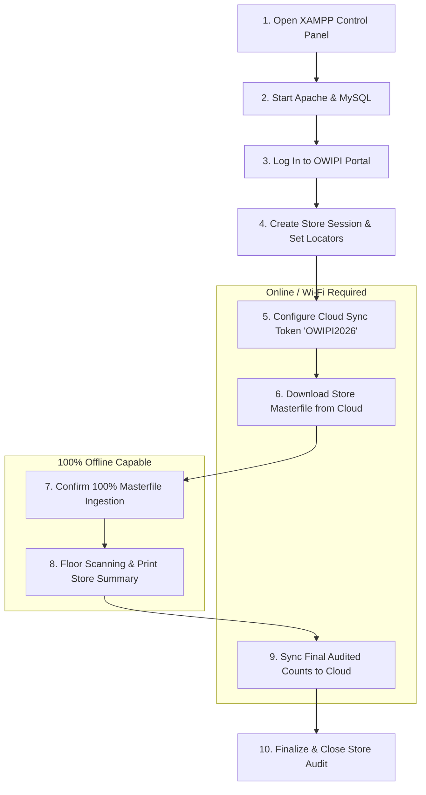

# OWI PHYSICAL INVENTORY (OWIPI)
## Standard Operating Procedure (SOP) & Step-by-Step User Manual

This manual provides the official, step-by-step operating procedure for setting up, conducting, and finalizing physical inventory counts using the **OWI Physical Inventory System**.

---

## 🧭 Operational Workflow Overview

---

## 📋 10-Step Standard Operating Procedure

### Step 1: Open the XAMPP Control Panel
* **Action**:
  1. Press the **Windows Key** on the host laptop.
  2. In the Windows search bar, type `XAMPP Control Panel`.
  3. Right-click and choose **Run as administrator** (or click Open).
* **Technical Rationale**: Running as administrator ensures Windows Firewall does not restrict incoming handheld scanner connections across local Wi-Fi.

---

### Step 2: Start Apache & MySQL Services
* **Action**:
  1. In the XAMPP window, locate the **Apache** and **MySQL** modules.
  2. Click **Start** next to **Apache** (Wait until PID and Ports `80, 443` turn green).
  3. Click **Start** next to **MySQL** (Wait until Port `3306` turns green).
  4. Verify the status log confirms: `Status change detected: running`.
* **Important**: If Apache fails to start due to port conflicts, ensure Skype or IIS web services are terminated.

---

### Step 3: Open the System & Log In
* **Action**:
  1. Launch **Google Chrome** on the laptop.
  2. Navigate to: `http://localhost/OWIPI/`.
  3. Input your assigned supervisor credentials (**Username** and **Password**).
  4. Click the blue **Log In** button.
* **Handheld Note**: Floor auditors using mobile camera scanners or Casio terminals use **Handheld Scanner Mode (No Login Required)**.

---

### Step 4: Create Store Code & Set Locator Count
* **Action**:
  1. On the **Select Store Session** modal:
     - **Create / Connect New Store Code**: Enter the 3-letter retail branch code (e.g. `SLE` for Sunken Leaf Express).
     - **Number of Locators Needed**: Enter the initial number of shelf zones or gondola slots (e.g. `10`).
  2. Click **Activate Store Session**.
* **Result**: The system initializes the store tables in local MySQL and redirects to the **Host Console**.

---

### Step 5: Configure Cloud Sync Token
* **Action**:
  1. On the Host Console header, click the **☁️ Sync to Cloud** button.
  2. In the **Secret Sync Token** input field, enter: `OWIPI2026`.
  3. Click **Save Config**.
  4. Confirm the green banner displays: *"Cloud synchronization configuration saved successfully!"*.
  5. Click **Close**.

---

### Step 6: Download Store Masterfile from Cloud
* **Prerequisite**: Ensure the laptop is temporarily connected to the internet (via store Wi-Fi or mobile hotspot).
* **Action**:
  1. Click **☁️ Download Store Masterfile** in the top action bar.
  2. In the confirmation dialog (*"Are you sure you want to download and sync the items masterfile for store SLE from the cloud?"*), click **Yes, Proceed**.
* **Result**: The system fetches active product barcodes, descriptions, SKUs, and expected system stock from HQ servers.

---

### Step 7: Confirm Masterfile Ingestion Success
* **Action**:
  1. Wait a few moments while the local database indexes the catalog.
  2. When the dialog appears: *"Download Success: Successfully imported 8626 products for store SLE from cloud!"*, click **OK**.
* **Offline Readiness**: Once this step is complete, the laptop can operate **100% offline**. You may take the laptop onto the floor without internet connection.

---

### Step 8: Perform Auditing & Print Store Summary
* **Action**:
  1. Handheld scanners (Casio) and mobile phone camera operators scan all shelves.
  2. As each shelf finishes, auditors tap **[Finish]** to lock the slot.
  3. When all locators reach **100% CLOSED**, click **🖨️ Print Summary** on the count sheet toolbar.
  4. Choose your report format:
     - **Print All Summary**: Complete audit report including all items with zero variance.
     - **Print With Variance Only**: Filtered report highlighting only items with count discrepancies (+ / - variance) for immediate physical investigation.
  5. Have the Store Manager review and sign the count sheets.

---

### Step 9: Reconnect & Sync Final Counts to Cloud
* **Action**:
  1. Reconnect the laptop to the internet (Wi-Fi or hotspot).
  2. Click **☁️ Sync to Cloud** in the header.
  3. Click the blue **Start Sync** button.
  4. Confirm the green completion message: *"Successfully synchronized with the cloud! Synced X locators and Y scan records."*
* **Result**: All physical audit counts, operator tags, and timestamps are uploaded to central HQ.

---

### Step 10: Close Store Session
* **Action**:
  1. On the top right header, click **🔒 Close Store**.
  2. Confirm store closing when prompted.
* **Result**: The physical inventory session is officially locked to prevent accidental recount changes, archiving the final verified audit figures.

---

## 📊 Summary Reference Card

| Step | Screen / Module | Key Action | Internet Required? |
| :---: | :--- | :--- | :---: |
| **1** | Windows Search | Open `XAMPP Control Panel` as Admin | ❌ No |
| **2** | XAMPP GUI | Start `Apache` (80/443) & `MySQL` (3306) | ❌ No |
| **3** | Web Browser | Navigate to `localhost/OWIPI/` and Log In | ❌ No |
| **4** | Store Session Modal | Enter Store Code (`SLE`) & Locators (`10`) | ❌ No |
| **5** | Sync to Cloud Dialog | Input Token `OWIPI2026` & Save Config | ❌ No |
| **6** | Store Download Modal | Click `Download Store Masterfile` ➔ `Yes, Proceed` | **✅ YES** |
| **7** | Success Banner | Verify 8,626+ items imported ➔ Click `OK` | ❌ No |
| **8** | Count Sheet & Print | Wait for 100% Closed ➔ `Print Store Summary` | ❌ No |
| **9** | Cloud Sync Dialog | Click `Start Sync` to upload final counts | **✅ YES** |
| **10** | Host Header | Click `Close Store` to lock session | ❌ No |

---

## 🔗 Interactive Visual Manuals Suite

- 📋 **[Step-by-Step SOP Visual Guide](sop_visual_guide.html)** *(Interactive step walkthrough)*
- 🎛️ **[Control Dashboard Visual Manual](control_dashboard_visual_manual.html)** *(Administrator console)*
- 💻 **[Host Console Visual Manual](host_view_visual_manual.html)** *(Supervisor count sheet manager)*
- 📱 **[Casio Industrial Scanner Manual](casio_scanner_visual_manual.html)** *(Laser gun operator twin)*
- 📲 **[Mobile Phone Camera Scanner Manual](mobile_phone_scanner_visual_manual.html)** *(Smartphone camera scanner)*
